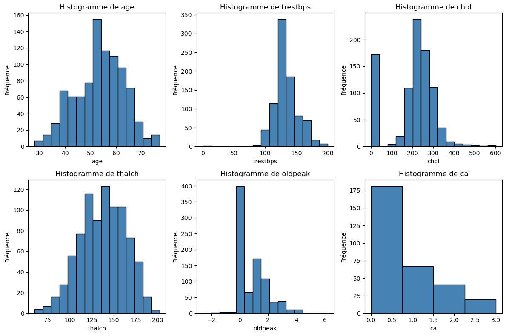
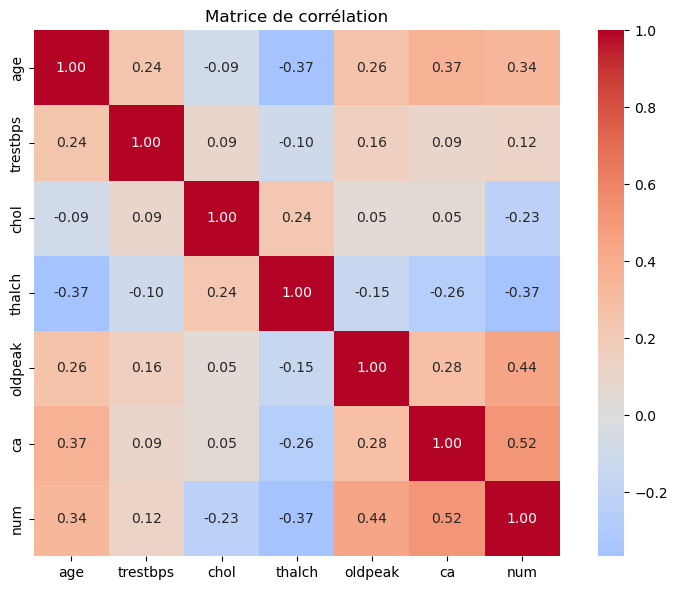
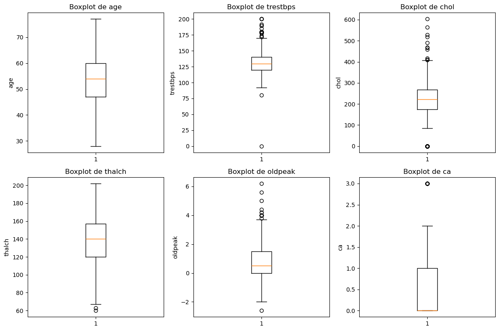

# Machine-Learning
L’objectif de ce projet est de mettre en place une application permettant de prédire du stade d’une maladie chronique. Cette prédiction est basée sur l’exploration, l’analyse, la modélisation et le nettoyage d’un gros volume de données open data, ensuite l’entraînement et l’évaluation de différents modèles de Machine Learning
## Exploration des données

Histogrammes des variables numériques : pour repérer les distributions et les valeurs extrêmes. 
-Valeur négatives dans la features oldpeak
-Valeur abberrantes :  présence de chol = 0 et trestbps = 0, physiologiquement impossibles,
à traiter comme des valeurs manquantes
-De nombreuses valeurs manquantes, notamment sur ca (∼67%), thal (∼53%), slope (∼33%).
-Distribution déséquilibrée de la cible num.

-On remarque le plupart de nos données sont importantes, test avec les features les plus importants, dégrade les performances. 

Plusieurs variales ont des écarts importants, on peut identifier les valeurs abberantes physiologiquement impossible (chol à 0 et oldpeak négatif).
## How to
Pour lancer le script avec l'interface:
```bash
pip install flask
export FLASK_APP=interface.py
flask run
```
# Le dataset : Heart Disease UCI
- 920 patients provenant de 4 hôpitaux différents

- 16 features : variables numériques (âge, pression artérielle, cholestérol, fréquence cardiaque max,
etc.) et variables catégorielles (sexe, type de douleur thoracique, etc.).


- Variable cible num : entier de 0 à 4 représentant le stade de la maladie cardiaque.
        - 0 : pas de maladie cardiaque
        - 1, 2, 3, 4 : présence de la maladie avec gravité croissante
- 411 échantillons: cible = 0
- 265 échantillons: cible = 1
- 109 échantillons: cible = 2
- 107 échantillons: cible = 3
- 28 échantillons: cible = 4
